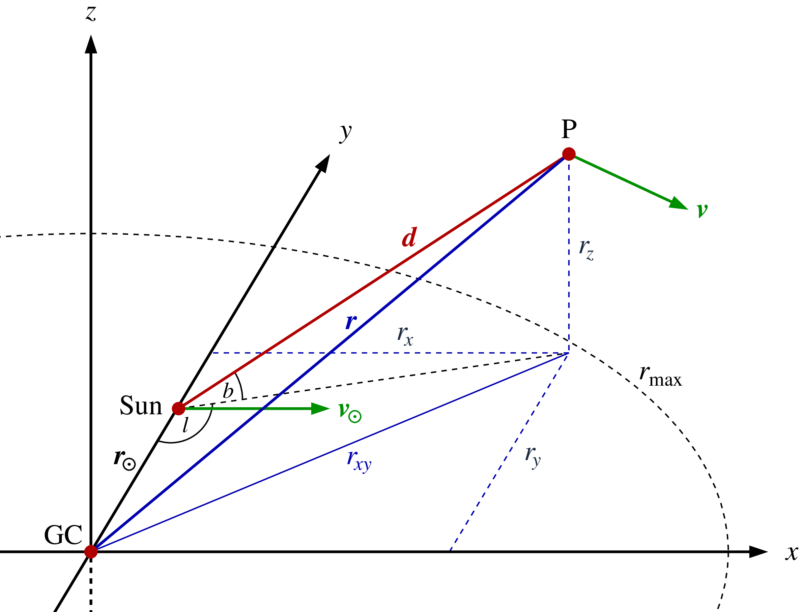
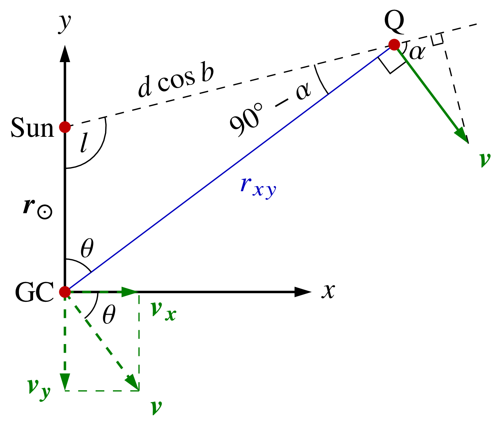
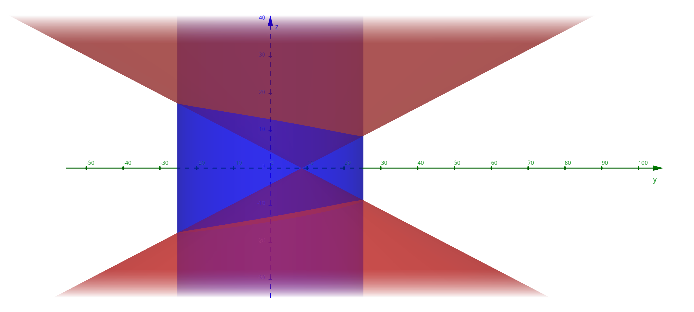
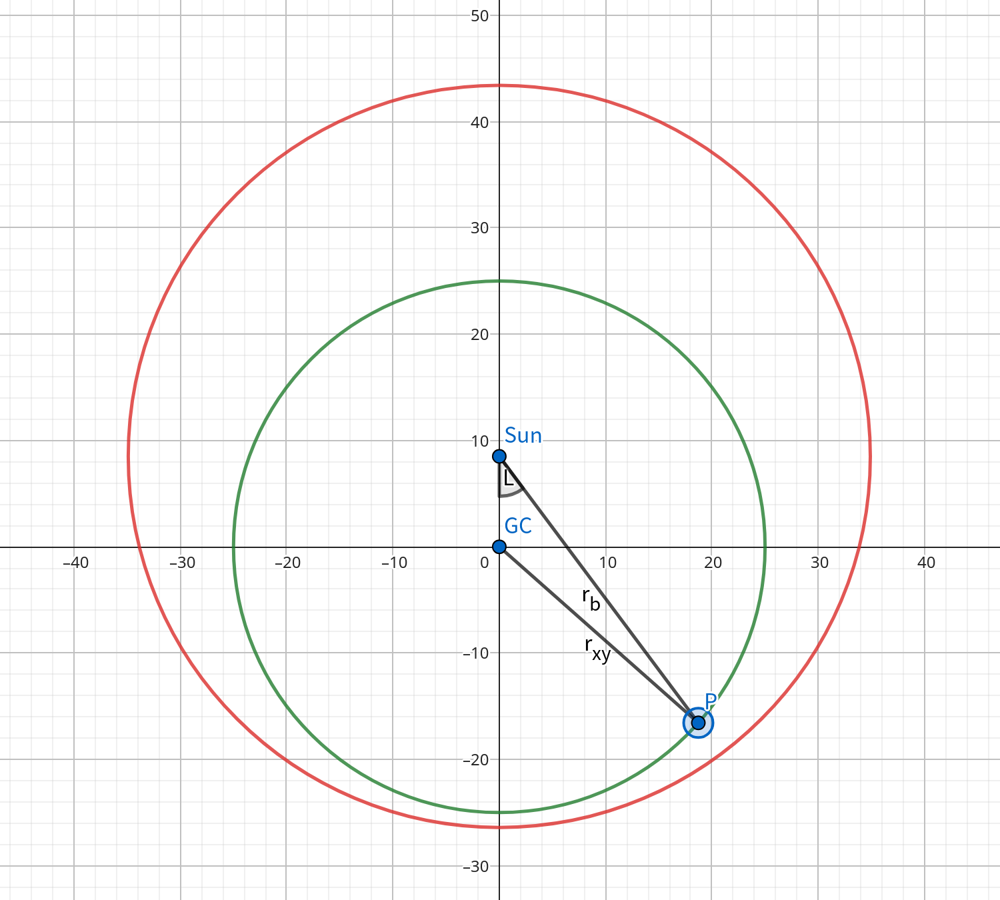
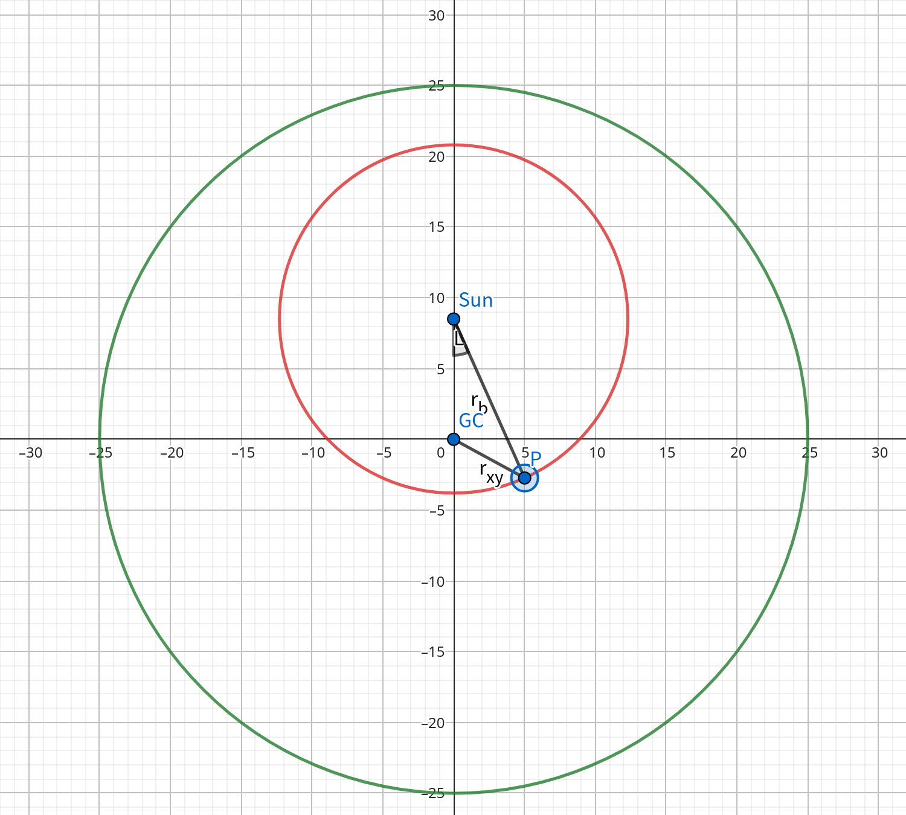
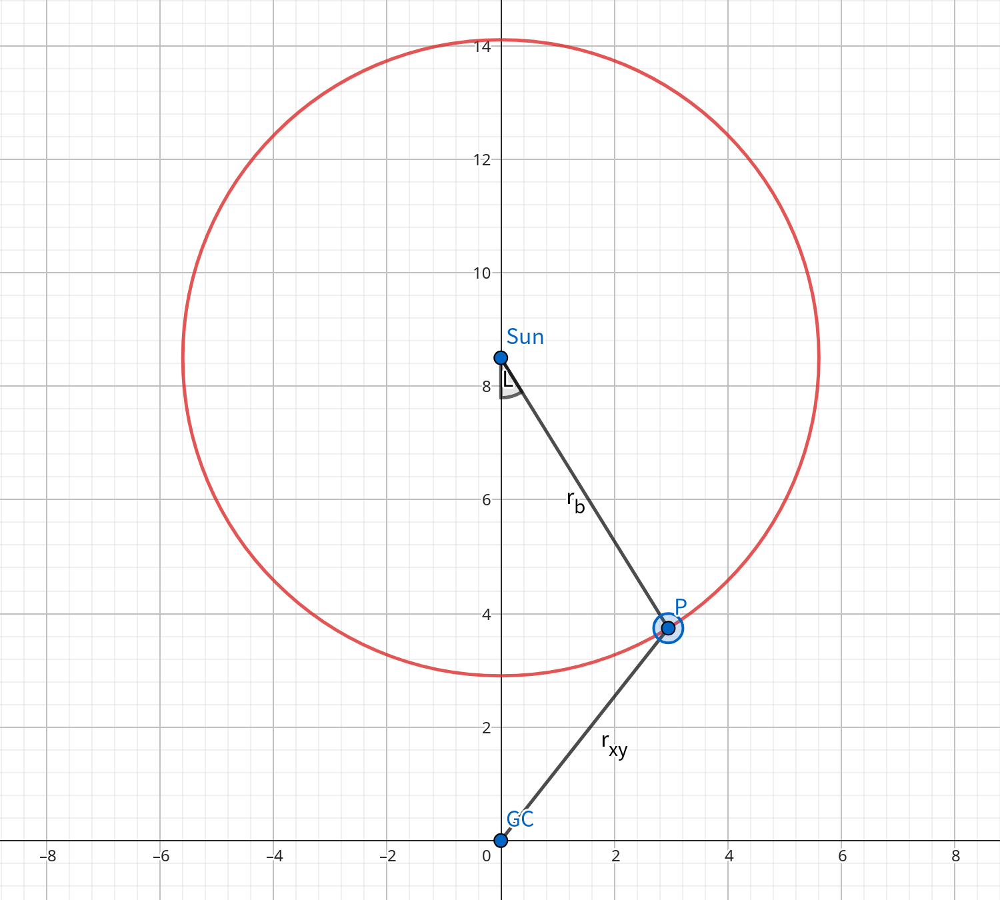
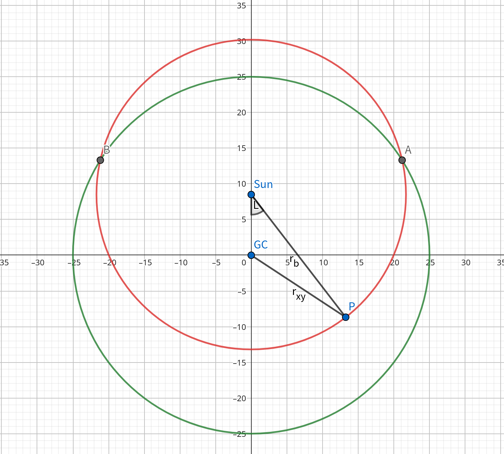

在如下的银河系模型中，太阳到银心的距离$r_\odot = 8.5\,\mathrm{kpc}$，太阳的公转速率为$v_\odot = 220\,\mathrm{km/s}$。

银心坐标系中太阳的坐标为$\vec{r}_\odot = (0, r_\odot, 0)$，速度沿$x$轴正方向，即$\vec{v} = (v_\odot, 0, 0)$。

假设有一个点P跟随银盘旋转运动，在垂直于银盘的方向无速度。P点在银心坐标系中坐标为$\vec{r} = (r_x, r_y, r_z)$，速度为$\vec{v} = (v_x, v_y, 0)$。在太阳坐标系中，太阳指向P的矢量是$\vec{d}$，则P的位置可以用银经$l$、银纬$b$和距离$d$表示为：
$$
\vec{r} = \begin{bmatrix} r_x \\ r_y \\ r_z \end{bmatrix} = \begin{bmatrix} d\sin{l}\cos{b} \\ r_{\odot} - d\cos{l}\cos{b} \\ d\sin{b} \end{bmatrix}
$$
下一步需要知道P对太阳的视向速度$v_{\mathrm{rad}}$。我们需要将速度$\vec{v}$投影到矢量$\vec{d}$上，再将太阳本身的旋转速度分量扣除：
$$
v_{\mathrm{rad}} = \frac{\vec{d} \cdot \vec{v} - \vec{d} \cdot \vec{v}_{\odot}}{|\vec{d}|} = \frac{\vec{d} \cdot (\vec{v} - \vec{v}_{\odot})}{|\vec{d}|} = \frac{(\vec{r} - \vec{r}_{\odot}) \cdot (\vec{v} - \vec{v}_{\odot})}{d}
$$
将$\vec{r}$和$\vec{v}$的坐标表达式代入上式即得：
$$
v_{\mathrm{rad}} = \frac{1}{d} \cdot \begin{bmatrix} d\sin{l}\cos{b} \\ -d\cos{l}\cos{b} \\ d\sin{b} \end{bmatrix} \cdot \begin{bmatrix} v_x - v_\odot \\ v_y \\ 0 \end{bmatrix} = (v_x - v_\odot) \sin{l}\cos{b} - v_y \cos{l}\cos{b}
$$
也可以写为：
$$
v_{\mathrm{rad}} = (v_x\sin{l} - v_y\cos{l}) \cos{b} - v_\odot \sin{l}\cos{b}
$$
下一步证明：
$$
v_x \sin{l} - v_y \cos{l} = v \frac{r_{\odot}}{r_{xy}} \sin{l}
$$

如图，Q为P在银盘平面的投影。在银心、太阳和Q点构成的三角形中，由正弦定理得：
$$
\frac{r_\odot}{\cos{\alpha}} = \frac{r_{xy}}{\cos{l}}
$$
即：
$$
v \frac{r_{\odot}}{r_{xy}} \sin{l} = v \cos{\alpha}
$$
而$v \cos{\alpha}$和$v_x \sin{l} - v_y \cos{l}$都是将$v$投影到太阳与Q的连线上，故：
$$
v \cos{\alpha} = v_x \sin{l} - v_y \cos{l}
$$
证明如下：记太阳与Q对银心的夹角为$\theta = 90^\circ + \alpha - l$，则
$$
v_x = v \cos{\theta} = -v \sin(\alpha - l),\quad v_y = -v \sin{\theta} = -v \cos(\alpha - l)
$$
则：
$$
v_x \sin{l} - v_y \cos{l} = -v \sin(\alpha - l) \sin{l} + v \cos(\alpha - l) \cos{l} = v \cos{\alpha}
$$
这里使用了两角和的余弦公式：
$$
\cos(a + b) = \cos{a} \cos{b} - \sin{a} \sin{b}
$$
于是有：
$$
v_x \sin{l} - v_y \cos{l} = v \cos{\alpha} = v \frac{r_{\odot}}{r_{xy}} \sin{l}
$$
综上所述：
$$
v_{\mathrm{rad}} = \left(v \frac{r_{\odot}}{r_{xy}} - v_{\odot}\right) \sin{l}\cos{b}
$$

---

现在讨论不同$l$和$b$下，$v_{\mathrm{rad}}$能达到的最大值和最小值。在以下讨论中，为简便起见，记$R = r_{xy}$。则有：
$$
v_{\mathrm{rad}} = v_\odot \left(\frac{r_{\odot}}{R} - 1\right) \sin{l}\cos{b}
$$
此时$v_{\mathrm{max}}$对应于$R_{\mathrm{min}}$、$v_{\mathrm{min}}$对应于$R_{\mathrm{max}}$，问题转化为求不同$l$和$b$下，$R = r_{xy}$能达到的最大值和最小值。

我们采用一个圆柱体的银河系旋转模型：设银河系是一个半径为$r_{\mathrm{gal}}$、高度为$2h$的圆柱体，旋转曲线为常数$v(R) \equiv v_\odot$，太阳位于$y = r_\odot$处。基于我们对银河系大小的认识，规定$r_{\mathrm{gal}} > 2r_\odot$。而位于太阳系的观测者视线扫过的区域为一个顶点在太阳系、半顶角为$90^\circ - b$的圆锥。理论上圆锥高度为无穷大，但我们只考虑圆锥高度为$h$的部分，则圆锥的底面半径为$r_h = h\tan{b}$。圆锥与圆柱的关系可以反映在底面两个圆$x^2 + y^2 = r_{\mathrm{gal}}^2$与$x^2 + (y-r_\odot)^2 = r_h^2$的位置关系上。

定义：
$$
r_l = \sqrt{r_\odot^2 + r_h^2 - 2r_\odot r_h \cos{l}}
$$
当$\cos{l} = \dfrac{r_h}{2r_\odot}$时，$r_l = r_\odot$；当$\cos{l} = \dfrac{r_h}{r_\odot}$时，$r_l = \sqrt{r_\odot^2 - r_h^2}$。

先不考虑圆锥和圆柱侧面的交线，在$b$不断增大，即$r_h$不断变小的过程中会发生三种典型情况：

1. $b = 0$

$$
R_{\mathrm{min}} =
\begin{cases}
r_\odot |\sin{l}|, & \cos{l} \geqslant 0 \\
r_\odot, & \cos{l} < 0
\end{cases}
$$

$$
R_{\mathrm{max}} =
\begin{cases}
r_{\mathrm{gal}}, & \cos{l} \geqslant 0 \\
r_{\mathrm{gal}}, & \cos{l} < 0
\end{cases}
$$

2. $r_\odot \leqslant r_h = h\tan{b} < 2r_\odot$

此时存在两个对称点，使得$r_h = r_\odot$，即银心、太阳、Q点构成以银心为顶点的等腰三角形，此时$\cos{l} = \dfrac{r_h}{2r_\odot}$。当$\cos{l} \geqslant \dfrac{r_h}{2r_\odot}$时，$r_\odot \geqslant r_l$，则$R_{\mathrm{max}} = r_\odot$，$v_{\mathrm{min}} = 0$。

$$
R_{\mathrm{min}} =
\begin{cases}
r_\odot |\sin{l}|, & \cos{l} \geqslant \dfrac{r_h}{2r_\odot} \\
r_\odot |\sin{l}|, & 0 \leqslant \cos{l} < \dfrac{r_h}{2r_\odot} \\
r_\odot, & \cos{l} < 0
\end{cases}
$$

$$
R_{\mathrm{max}} =
\begin{cases}
r_\odot, & \cos{l} \geqslant \dfrac{r_h}{2r_\odot} \\
r_l, & 0 \leqslant \cos{l} < \dfrac{r_h}{2r_\odot} \\
r_l, & \cos{l} < 0
\end{cases}
$$

3. $r_h = h\tan{b} < r_\odot$

此时银心在以太阳为圆心、$r_h$为半径的圆以外。可以做银心到该圆的切线，在切点以内$\cos{l} > \dfrac{r_h}{r_\odot}$，此时太阳到Q的线段上没有点使得$R = r_\odot |\sin{l}|$（因为$r_h < r_\odot \cos{l}$），$R_{\mathrm{min}}$只能取到$r_l$。

$$
R_{\mathrm{min}} =
\begin{cases}
r_l, & \cos{l} \geqslant \dfrac{r_h}{r_\odot} \\
r_\odot |\sin{l}|, & \dfrac{r_h}{2r_\odot} \leqslant \cos{l} < \dfrac{r_h}{r_\odot} \\
r_\odot |\sin{l}|, & 0 \leqslant \cos{l} < \dfrac{r_h}{2r_\odot} \\
r_\odot, & \cos{l} < 0
\end{cases}
$$

$$
R_{\mathrm{max}} =
\begin{cases}
r_\odot, & \cos{l} \geqslant \dfrac{r_h}{r_\odot} \\
r_\odot, & \dfrac{r_h}{2r_\odot} \leqslant \cos{l} < \dfrac{r_h}{r_\odot} \\
r_l, & 0 \leqslant \cos{l} < \dfrac{r_h}{2r_\odot} \\
r_l, & \cos{l} < 0
\end{cases}
$$

---

考虑圆锥和圆柱侧面有交线的情况。如果对于某一个银经$l$，太阳到银河系边缘的距离大于$r_h$，则$R$的最大值无法取到$r_{\mathrm{gal}}$，只能取：
$$
r_l = \sqrt{r_\odot^2 + r_h^2 - 2r_\odot r_h \cos{l}}
$$

圆锥面的半顶角为$90^\circ - b$，圆锥方程为：
$$
z^2 = [x^2 + (y-r_\odot)^2] \tan^2{b}
$$
和圆柱面：
$$
x^2 + y^2 = r_{\mathrm{gal}}^2
$$
的交线为抛物柱面：
$$
z^2 = [r_{\mathrm{gal}}^2 - 2r_\odot y + r_\odot^2] \tan^2{b}
$$
的一部分。

考虑圆$x^2 + y^2 = r_{\mathrm{gal}}^2$与$x^2 + (y-r_\odot)^2 = r_h^2$的交点：
$$
r_{\mathrm{gal}}^2 - 2r_\odot y_0 + r_\odot^2 = r_h^2
$$
即：
$$
y_0 = \frac{r_{\mathrm{gal}}^2 + r_\odot^2 - r_h^2}{2r_\odot}
$$
这对应的银经为：
$$
\cos{l} = \frac{r_\odot - y_0}{r_h}
$$
容易证明：（两边同乘$2r_\odot r_h$，这等价于$r_\odot < r_{\mathrm{gal}}$）
$$
\frac{r_\odot - y_0}{r_h} < \frac{r_h}{2r_\odot}
$$
当$r_{\mathrm{gal}} - r_\odot < r_h < r_{\mathrm{gal}} + r_\odot$时会出现交点。交点的$\cos{l} = 0$对应于：
$$
r_h = \sqrt{r_{\mathrm{gal}}^2 - r_\odot^2}
$$
临界点：
$$
r_{\mathrm{gal}} - r_\odot < r_h < r_{\mathrm{gal}} + r_\odot \\
r_\odot < r_h < 2r_\odot
$$
若$2r_\odot < r_{\mathrm{gal}} < 3r_\odot$（取$r_\odot = 8.5\,\mathrm{kpc}$，即为$17\,\mathrm{kpc} < r_{\mathrm{gal}} < 25.5\,\mathrm{kpc}$），则有：
$$
r_\odot < r_{\mathrm{gal}} - r_\odot < 2r_\odot < r_{\mathrm{gal}} + r_\odot
$$

值得注意的是，当$r_{\mathrm{gal}} > \sqrt{5} r_\odot$时，交点的$\cos{l} = 0$对应于：
$$
r_h = \sqrt{r_{\mathrm{gal}}^2 - r_\odot^2} > 2r_\odot
$$
也就是交点$y_0$从$y_0 < r_\odot$到$y_0 > r_\odot$的变化一定发生在$r_h > 2r_\odot$的阶段。取$r_\odot = 8.5\,\mathrm{kpc}$，则$\sqrt{5} r_\odot \approx 19\,\mathrm{kpc}$，按照目前对银河系的认知，设定$r_{\mathrm{gal}} > \sqrt{5} r_\odot$是合理的。

---

综上，假设$\sqrt{5} r_\odot \leqslant r_{\mathrm{gal}} < 3r_\odot$，在$b$不断增大，即$r_h$不断变小的过程中会发生如下变化：

1. $r_h \geqslant r_{\mathrm{gal}} + r_\odot$：圆锥和圆柱侧面有交线，但底面没有。

$$
R_{\mathrm{min}} =
\begin{cases}
r_\odot |\sin{l}|, & \cos{l} \geqslant 0 \\
r_\odot, & \cos{l} < 0
\end{cases}
$$

$$
R_{\mathrm{max}} =
\begin{cases}
r_{\mathrm{gal}}, & \cos{l} \geqslant 0 \\
r_{\mathrm{gal}}, & \cos{l} < 0
\end{cases}
$$

2. $\sqrt{r_{\mathrm{gal}}^2 - r_\odot^2} \leqslant r_h < r_{\mathrm{gal}} + r_\odot$：圆锥和圆柱底面有交线，且交线两端点$y_0$位于第一、四象限。

$$
R_{\mathrm{min}} =
\begin{cases}
r_\odot |\sin{l}|, & \cos{l} \geqslant \dfrac{r_\odot - y_0}{r_h} \\
r_\odot |\sin{l}|, & 0 \leqslant \cos{l} < \dfrac{r_\odot - y_0}{r_h} \\
r_\odot, & \cos{l} < 0
\end{cases}
$$

$$
R_{\mathrm{max}} =
\begin{cases}
r_l, & \cos{l} \geqslant \dfrac{r_\odot - y_0}{r_h} \\
r_{\mathrm{gal}}, & 0 \leqslant \cos{l} < \dfrac{r_\odot - y_0}{r_h} \\
r_{\mathrm{gal}}, & \cos{l} < 0
\end{cases}
$$

3. $2r_\odot \leqslant r_h < \sqrt{r_{\mathrm{gal}}^2 - r_\odot^2}$：圆锥和圆柱底面有交线，且交线两端点$y_0$位于第二、三象限，尚未触发典型情况2。

$$
R_{\mathrm{min}} =
\begin{cases}
r_\odot |\sin{l}|, & \cos{l} \geqslant 0 \\
r_\odot, & \dfrac{r_\odot - y_0}{r_h} \leqslant \cos{l} < 0 \\
r_\odot, & \cos{l} < \dfrac{r_\odot - y_0}{r_h}
\end{cases}
$$

$$
R_{\mathrm{max}} =
\begin{cases}
r_l, & \cos{l} \geqslant 0 \\
r_l, & \dfrac{r_\odot - y_0}{r_h} \leqslant \cos{l} < 0 \\
r_{\mathrm{gal}}, & \cos{l} < \dfrac{r_\odot - y_0}{r_h}
\end{cases}
$$

4. $r_{\mathrm{gal}} - r_\odot \leqslant r_h < 2r_\odot$：圆锥和圆柱底面有交线，且交线两端点$y_0$位于第二、三象限，触发典型情况2。

$$
R_{\mathrm{min}} =
\begin{cases}
r_\odot |\sin{l}|, & \cos{l} \geqslant \dfrac{r_h}{2r_\odot} \\
r_\odot |\sin{l}|, & 0 \leqslant \cos{l} < \dfrac{r_h}{2r_\odot} \\
r_\odot, & \dfrac{r_\odot - y_0}{r_h} \leqslant \cos{l} < 0 \\
r_\odot, & \cos{l} < \dfrac{r_\odot - y_0}{r_h}
\end{cases}
$$

$$
R_{\mathrm{max}} =
\begin{cases}
r_\odot, & \cos{l} \geqslant \dfrac{r_h}{2r_\odot} \\
r_l, & 0 \leqslant \cos{l} < \dfrac{r_h}{2r_\odot} \\
r_l, & \dfrac{r_\odot - y_0}{r_h} \leqslant \cos{l} < 0 \\
r_{\mathrm{gal}}, & \cos{l} < \dfrac{r_\odot - y_0}{r_h}
\end{cases}
$$

5. $r_\odot \leqslant r_h < r_{\mathrm{gal}} - r_\odot$：圆锥底面完全在圆柱底面内，触发典型情况2。

$$
R_{\mathrm{min}} =
\begin{cases}
r_\odot |\sin{l}|, & \cos{l} \geqslant \dfrac{r_h}{2r_\odot} \\
r_\odot |\sin{l}|, & 0 \leqslant \cos{l} < \dfrac{r_h}{2r_\odot} \\
r_\odot, & \cos{l} < 0
\end{cases}
$$

$$
R_{\mathrm{max}} =
\begin{cases}
r_\odot, & \cos{l} \geqslant \dfrac{r_h}{2r_\odot} \\
r_l, & 0 \leqslant \cos{l} < \dfrac{r_h}{2r_\odot} \\
r_l, & \cos{l} < 0
\end{cases}
$$

6. $r_h < r_\odot$：圆锥底面完全在圆柱底面内，触发典型情况3。

$$
R_{\mathrm{min}} =
\begin{cases}
r_l, & \cos{l} \geqslant \dfrac{r_h}{r_\odot} \\
r_\odot |\sin{l}|, & \dfrac{r_h}{2r_\odot} \leqslant \cos{l} < \dfrac{r_h}{r_\odot} \\
r_\odot |\sin{l}|, & 0 \leqslant \cos{l} < \dfrac{r_h}{2r_\odot} \\
r_\odot, & \cos{l} < 0
\end{cases}
$$

$$
R_{\mathrm{max}} =
\begin{cases}
r_\odot, & \cos{l} \geqslant \dfrac{r_h}{r_\odot} \\
r_\odot, & \dfrac{r_h}{2r_\odot} \leqslant \cos{l} < \dfrac{r_h}{r_\odot} \\
r_l, & 0 \leqslant \cos{l} < \dfrac{r_h}{2r_\odot} \\
r_l, & \cos{l} < 0
\end{cases}
$$

---

同理，假设$r_{\mathrm{gal}} \geqslant 3r_\odot$，在$b$不断增大，即$r_h$不断变小的过程中会发生如下变化：

1. $r_h \geqslant r_{\mathrm{gal}} + r_\odot$：圆锥和圆柱侧面有交线，但底面没有。

$$
R_{\mathrm{min}} =
\begin{cases}
r_\odot |\sin{l}|, & \cos{l} \geqslant 0 \\
r_\odot, & \cos{l} < 0
\end{cases}
$$

$$
R_{\mathrm{max}} =
\begin{cases}
r_{\mathrm{gal}}, & \cos{l} \geqslant 0 \\
r_{\mathrm{gal}}, & \cos{l} < 0
\end{cases}
$$

2. $\sqrt{r_{\mathrm{gal}}^2 - r_\odot^2} \leqslant r_h < r_{\mathrm{gal}} + r_\odot$：圆锥和圆柱底面有交线，且交线两端点$y_0$位于第一、四象限。

$$
R_{\mathrm{min}} =
\begin{cases}
r_\odot |\sin{l}|, & \cos{l} \geqslant \dfrac{r_\odot - y_0}{r_h} \\
r_\odot |\sin{l}|, & 0 \leqslant \cos{l} < \dfrac{r_\odot - y_0}{r_h} \\
r_\odot, & \cos{l} < 0
\end{cases}
$$

$$
R_{\mathrm{max}} =
\begin{cases}
r_l, & \cos{l} \geqslant \dfrac{r_\odot - y_0}{r_h} \\
r_{\mathrm{gal}}, & 0 \leqslant \cos{l} < \dfrac{r_\odot - y_0}{r_h} \\
r_{\mathrm{gal}}, & \cos{l} < 0
\end{cases}
$$

3. $r_{\mathrm{gal}} - r_\odot \leqslant r_h < \sqrt{r_{\mathrm{gal}}^2 - r_\odot^2}$：圆锥和圆柱底面有交线，且交线两端点$y_0$位于第二、三象限。

$$
R_{\mathrm{min}} =
\begin{cases}
r_\odot |\sin{l}|, & \cos{l} \geqslant 0 \\
r_\odot, & \dfrac{r_\odot - y_0}{r_h} \leqslant \cos{l} < 0 \\
r_\odot, & \cos{l} < \dfrac{r_\odot - y_0}{r_h}
\end{cases}
$$

$$
R_{\mathrm{max}} =
\begin{cases}
r_l, & \cos{l} \geqslant 0 \\
r_l, & \dfrac{r_\odot - y_0}{r_h} \leqslant \cos{l} < 0 \\
r_{\mathrm{gal}}, & \cos{l} < \dfrac{r_\odot - y_0}{r_h}
\end{cases}
$$

4. $2r_\odot \leqslant r_h < r_{\mathrm{gal}} - r_\odot$：圆锥底面完全在圆柱底面内，尚未触发典型情况2。

$$
R_{\mathrm{min}} =
\begin{cases}
r_\odot |\sin{l}|, & \cos{l} \geqslant 0 \\
r_\odot, & \cos{l} < 0
\end{cases}
$$

$$
R_{\mathrm{max}} =
\begin{cases}
r_l, & \cos{l} \geqslant 0 \\
r_{\mathrm{gal}}, & \cos{l} < 0
\end{cases}
$$

5. $r_\odot \leqslant r_h < 2r_\odot$：圆锥底面完全在圆柱底面内，触发典型情况2。

$$
R_{\mathrm{min}} =
\begin{cases}
r_\odot |\sin{l}|, & \cos{l} \geqslant \dfrac{r_h}{2r_\odot} \\
r_\odot |\sin{l}|, & 0 \leqslant \cos{l} < \dfrac{r_h}{2r_\odot} \\
r_\odot, & \cos{l} < 0
\end{cases}
$$

$$
R_{\mathrm{max}} =
\begin{cases}
r_\odot, & \cos{l} \geqslant \dfrac{r_h}{2r_\odot} \\
r_l, & 0 \leqslant \cos{l} < \dfrac{r_h}{2r_\odot} \\
r_l, & \cos{l} < 0
\end{cases}
$$

6. $r_h < r_\odot$：圆锥底面完全在圆柱底面内，触发典型情况3。

$$
R_{\mathrm{min}} =
\begin{cases}
r_l, & \cos{l} \geqslant \dfrac{r_h}{r_\odot} \\
r_\odot |\sin{l}|, & \dfrac{r_h}{2r_\odot} \leqslant \cos{l} < \dfrac{r_h}{r_\odot} \\
r_\odot |\sin{l}|, & 0 \leqslant \cos{l} < \dfrac{r_h}{2r_\odot} \\
r_\odot, & \cos{l} < 0
\end{cases}
$$

$$
R_{\mathrm{max}} =
\begin{cases}
r_\odot, & \cos{l} \geqslant \dfrac{r_h}{r_\odot} \\
r_\odot, & \dfrac{r_h}{2r_\odot} \leqslant \cos{l} < \dfrac{r_h}{r_\odot} \\
r_l, & 0 \leqslant \cos{l} < \dfrac{r_h}{2r_\odot} \\
r_l, & \cos{l} < 0
\end{cases}
$$

---

当然我们也可以讨论$2r_\odot \leqslant r_{\mathrm{gal}} < \sqrt{5} r_\odot$，在$b$不断增大，即$r_h$不断变小的过程中会发生如下变化：

1. $r_h \geqslant r_{\mathrm{gal}} + r_\odot$：圆锥和圆柱侧面有交线，但底面没有。

$$
R_{\mathrm{min}} =
\begin{cases}
r_\odot |\sin{l}|, & \cos{l} \geqslant 0 \\
r_\odot, & \cos{l} < 0
\end{cases}
$$

$$
R_{\mathrm{max}} =
\begin{cases}
r_{\mathrm{gal}}, & \cos{l} \geqslant 0 \\
r_{\mathrm{gal}}, & \cos{l} < 0
\end{cases}
$$

2. $2r_\odot \leqslant r_h < r_{\mathrm{gal}} + r_\odot$：圆锥和圆柱底面有交线，且交线两端点$y_0$位于第一、四象限，尚未触发典型情况2。

$$
R_{\mathrm{min}} =
\begin{cases}
r_\odot |\sin{l}|, & \cos{l} \geqslant \dfrac{r_\odot - y_0}{r_h} \\
r_\odot |\sin{l}|, & 0 \leqslant \cos{l} < \dfrac{r_\odot - y_0}{r_h} \\
r_\odot, & \cos{l} < 0
\end{cases}
$$

$$
R_{\mathrm{max}} =
\begin{cases}
r_l, & \cos{l} \geqslant \dfrac{r_\odot - y_0}{r_h} \\
r_{\mathrm{gal}}, & 0 \leqslant \cos{l} < \dfrac{r_\odot - y_0}{r_h} \\
r_{\mathrm{gal}}, & \cos{l} < 0
\end{cases}
$$

3. $\sqrt{r_{\mathrm{gal}}^2 - r_\odot^2} \leqslant r_h < 2r_\odot$：圆锥和圆柱底面有交线，且交线两端点$y_0$位于第一、四象限，触发典型情况2。

$$
R_{\mathrm{min}} =
\begin{cases}
r_\odot |\sin{l}|, & \cos{l} \geqslant \dfrac{r_h}{2r_\odot} \\
r_\odot, & \dfrac{r_\odot - y_0}{r_h} \leqslant \cos{l} < \dfrac{r_h}{2r_\odot} \\
r_\odot, & \cos{l} < \dfrac{r_\odot - y_0}{r_h}
\end{cases}
$$

$$
R_{\mathrm{max}} =
\begin{cases}
r_\odot, & \cos{l} \geqslant \dfrac{r_h}{2r_\odot} \\
r_l, & \dfrac{r_\odot - y_0}{r_h} \leqslant \cos{l} < \dfrac{r_h}{2r_\odot} \\
r_{\mathrm{gal}}, & \cos{l} < \dfrac{r_\odot - y_0}{r_h}
\end{cases}
$$

4. $r_{\mathrm{gal}} - r_\odot \leqslant r_h < \sqrt{r_{\mathrm{gal}}^2 - r_\odot^2}$：圆锥和圆柱底面有交线，且交线两端点$y_0$位于第二、三象限，触发典型情况2。

$$
R_{\mathrm{min}} =
\begin{cases}
r_\odot |\sin{l}|, & \cos{l} \geqslant \dfrac{r_h}{2r_\odot} \\
r_\odot |\sin{l}|, & 0 \leqslant \cos{l} < \dfrac{r_h}{2r_\odot} \\
r_\odot, & \dfrac{r_\odot - y_0}{r_h} \leqslant \cos{l} < 0 \\
r_\odot, & \cos{l} < \dfrac{r_\odot - y_0}{r_h}
\end{cases}
$$

$$
R_{\mathrm{max}} =
\begin{cases}
r_\odot, & \cos{l} \geqslant \dfrac{r_h}{2r_\odot} \\
r_l, & 0 \leqslant \cos{l} < \dfrac{r_h}{2r_\odot} \\
r_l, & \dfrac{r_\odot - y_0}{r_h} \leqslant \cos{l} < 0 \\
r_\odot, & \cos{l} < \dfrac{r_\odot - y_0}{r_h}
\end{cases}
$$

5. $r_\odot \leqslant r_h < r_{\mathrm{gal}} - r_\odot$：圆锥底面完全在圆柱底面内，触发典型情况2。

$$
R_{\mathrm{min}} =
\begin{cases}
r_\odot |\sin{l}|, & \cos{l} \geqslant \dfrac{r_h}{2r_\odot} \\
r_\odot |\sin{l}|, & 0 \leqslant \cos{l} < \dfrac{r_h}{2r_\odot} \\
r_\odot, & \cos{l} < 0
\end{cases}
$$

$$
R_{\mathrm{max}} =
\begin{cases}
r_\odot, & \cos{l} \geqslant \dfrac{r_h}{2r_\odot} \\
r_l, & 0 \leqslant \cos{l} < \dfrac{r_h}{2r_\odot} \\
r_l, & \cos{l} < 0
\end{cases}
$$

6. $r_h < r_\odot$：圆锥底面完全在圆柱底面内，触发典型情况3。

$$
R_{\mathrm{min}} =
\begin{cases}
r_l, & \cos{l} \geqslant \dfrac{r_h}{r_\odot} \\
r_\odot |\sin{l}|, & \dfrac{r_h}{2r_\odot} \leqslant \cos{l} < \dfrac{r_h}{r_\odot} \\
r_\odot |\sin{l}|, & 0 \leqslant \cos{l} < \dfrac{r_h}{2r_\odot} \\
r_\odot, & \cos{l} < 0
\end{cases}
$$

$$
R_{\mathrm{max}} =
\begin{cases}
r_\odot, & \cos{l} \geqslant \dfrac{r_h}{r_\odot} \\
r_\odot, & \dfrac{r_h}{2r_\odot} \leqslant \cos{l} < \dfrac{r_h}{r_\odot} \\
r_l, & 0 \leqslant \cos{l} < \dfrac{r_h}{2r_\odot} \\
r_l, & \cos{l} < 0
\end{cases}
$$

---

参考文献：

Wakker B P. *Distribution and origin of high-velocity clouds. II-Statistical analysis of the whole-sky survey*[J]. Astronomy and Astrophysics (ISSN 0004-6361), vol. 250, no. 2, Oct. 1991, p. 499-508. Research supported by ASTRON., 1991, 250: 499-508.

Westmeier T. *A new all-sky map of Galactic high-velocity clouds from the 21-cm HI4PI survey*[J]. Monthly Notices of the Royal Astronomical Society, 2018, 474(1): 289-299.